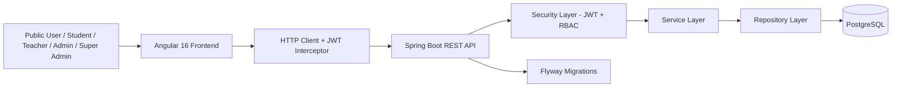
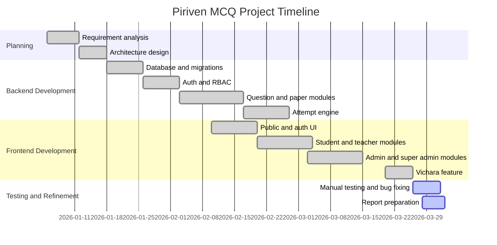

# Technical Report Draft

## Cover Page

- Student Name: [Your Full Name]
- Project Title: Piriven MCQ Past Paper System
- Assignment: Final Individual Project - Advanced AI and Software Engineering Program
- Campus: C-Clarke Campus
- Submission Date: [Insert Date]

## Table of Contents

1. Introduction and Scenario Explanation
2. System Architecture and AI/LLM Integration
3. API Integration Details
4. Frontend and Backend Interaction
5. Testing Process
6. Limitations and Challenges
7. Future Improvements
8. References
9. Project Management Timeline

## 1. Introduction and Scenario Explanation

Piriven MCQ Past Paper System is a web-based examination and learning platform designed for Sri Lankan Piriven education. The system digitizes past-paper and practice-paper MCQ workflows so that students can attempt papers online, teachers can prepare questions, and administrators can review, approve, and manage academic content through a controlled process.

The real-world problem addressed by this project is the difficulty of managing MCQ-based past papers manually across multiple user groups. In a traditional process, question preparation, moderation, student practice, timing control, and result evaluation are fragmented. This system centralizes those activities into one platform and reduces operational overhead while improving consistency and traceability.

The application is intended to operate in an academic setting where different user roles have different responsibilities:

- Students attempt timed papers and view results.
- Teachers create questions and practice papers for assigned subjects.
- Admin users verify teachers, manage subjects and papers, and approve academic content.
- Super administrators have system-wide control over sensitive records and moderation flows.

The main objectives of the project are:

- Provide a secure role-based MCQ management platform.
- Enforce exam rules such as total duration and per-question timing.
- Support approval workflows for question and practice-paper quality control.
- Offer a Sinhala-friendly frontend for local users.
- Extend the platform with public-facing educational content such as the Vichara section.

Expected outcomes include faster content administration, improved exam fairness through server-side timing, better user accountability, and a smoother learning experience for Piriven students.

## 2. System Architecture and AI/LLM Integration

The project follows a full-stack web architecture with a separated Angular frontend and Spring Boot backend connected through REST APIs.

### 2.1 High-Level Architecture



### 2.2 Backend Architecture

The backend is implemented as a modular monolith using a layered architecture:

- Controller layer handles REST endpoints.
- Service layer contains business rules.
- Repository layer accesses PostgreSQL using Spring Data JPA.
- DTOs separate API contracts from persistence entities.

Main backend technologies:

- Java 21
- Spring Boot 3.2.3
- Spring Security
- Spring Data JPA
- PostgreSQL
- Flyway
- JWT
- OWASP Java HTML Sanitizer

Key backend modules include:

- Authentication and registration
- User and role management
- Subject management
- Question creation and approval
- Paper and practice-paper management
- Student attempt and result tracking
- Public statistics and Vichara content delivery

### 2.3 Frontend Architecture

The frontend is built with Angular 16 and Angular Material. It uses lazy-loaded route groups and separate shells for public pages and authenticated dashboards.

Main frontend technologies:

- Angular 16
- Angular Material 16
- RxJS
- SCSS
- ngx-quill rich text editor

The UI is organized into:

- Public pages for landing, about, vision, videos, contact, and Vichara
- Auth pages for login and registration
- Role-based dashboards for student, teacher, admin, and super admin
- Shared services, guards, interceptors, and reusable components

### 2.4 Data Flow

The typical data flow is:

1. A user performs an action in the Angular UI.
2. Angular services send an HTTP request to the backend.
3. JWT is attached automatically for protected routes.
4. Spring Security validates the token and role.
5. The controller delegates the request to a service.
6. The service interacts with repositories and database entities.
7. The backend returns JSON DTO responses.
8. Angular renders the data or updates the interface state.

### 2.5 AI/LLM Integration

Based on the current implementation, this project does not contain active AI or LLM integration in the application runtime. There is no code-level evidence of a connected LLM API, prompt pipeline, model inference service, or AI-assisted recommendation module.

This means the project should be reported honestly as a conventional full-stack academic platform rather than claiming embedded AI functionality. If required by the module context, this can be framed as a software engineering project developed within an AI and Software Engineering program, while the current product scope focuses on secure educational workflow automation instead of live AI features.

### 2.6 Key Design Decisions

- Angular was selected for structured SPA development, route guarding, and strong TypeScript support.
- Spring Boot was selected for mature security, validation, and REST support.
- PostgreSQL was selected for relational consistency and strong constraint support.
- Flyway was used to version schema and seed data changes safely.
- JWT was used to keep authentication stateless.
- Server-side timing was chosen to reduce client-side manipulation risk during exams.
- OWASP HTML Sanitizer was added for the Vichara module to reduce XSS risk when handling rich text content.

## 3. API Integration Details

The system mainly uses internal REST APIs between the Angular frontend and the Spring Boot backend. Responses are exchanged in JSON format.

### 3.1 Authentication API

Authentication is handled through JWT-based endpoints.

Example login request:

```http
POST /api/auth/login
Content-Type: application/json

{
  "email": "admin@piriven.com",
  "password": "Admin@123"
}
```

Example response:

```json
{
  "token": "<jwt-token>",
  "tokenType": "Bearer",
  "userId": "...",
  "email": "admin@piriven.com",
  "fullName": "Administrator",
  "role": "ADMIN"
}
```

### 3.2 Authorization Model

- Public routes: `/api/public/**`
- Auth routes: `/api/auth/**`
- Student routes: `/api/student/**`
- Teacher routes: `/api/teacher/**`
- Admin routes: `/api/admin/**`
- Super admin routes: `/api/superadmin/**`

Protected requests use the HTTP header below:

```http
Authorization: Bearer <jwt-token>
```

### 3.3 Core API Areas

Important API groups in the project include:

- Authentication and registration
- Public statistics
- Subject listing and administration
- Question creation, review, approval, and deletion
- Paper creation and paper-question assignment
- Practice-paper approval workflow
- Student attempt lifecycle: start, next question, answer, submit, result
- Student answer review by teachers and admins
- Public and admin Vichara APIs

### 3.4 Example Internal API Consumption from Angular

The frontend centralizes backend communication through `ApiService`.

```typescript
getPublicStats(): Observable<PublicStats> {
  return this.http.get<PublicStats>(`${BASE}/api/public/stats`);
}

startAttempt(paperId: string): Observable<AttemptStartResponse> {
  return this.http.post<AttemptStartResponse>(
    `${BASE}/api/student/papers/${paperId}/attempts/start`,
    {},
  );
}
```

### 3.5 Vichara API Example

The Vichara feature exposes public read endpoints and admin CRUD endpoints.

```http
GET /api/public/vichara/subjects
GET /api/public/vichara?subjectId=<uuid>&page=0&size=10
POST /api/admin/vichara
PUT /api/admin/vichara/{id}
DELETE /api/admin/vichara/{id}
```

This design allows public users to read content without authentication while keeping authoring restricted to administrative roles.

## 4. Frontend and Backend Interaction

The frontend communicates with the backend using Angular `HttpClient`. A JWT interceptor automatically adds the token to outgoing requests after login.

### 4.1 Request Handling

- Authentication state is managed in `AuthService`.
- API requests are grouped in `ApiService`.
- Route access is controlled by `authGuard` and `roleGuard`.
- HTTP requests target the backend base URL configured in the Angular environment file.

### 4.2 State and Rendering

The frontend uses RxJS for reactive state handling and timer-related behaviors. Data returned from the backend is rendered into dashboard cards, tables, forms, lists, and examination views.

Examples of frontend-backend coordination:

- Student dashboards request available years and papers.
- Exam screens request one question at a time and submit answers incrementally.
- Teacher screens create and update questions before sending them for review.
- Admin screens manage users, subjects, papers, and Vichara content.
- Public pages request statistics and public Vichara data without requiring login.

### 4.3 Security and Session Handling

- Login responses store token and user data in local storage.
- Expired or malformed tokens are cleared automatically.
- Unauthorized users are redirected to login or their permitted dashboards.
- Backend role checks and frontend route guards work together to protect sensitive views.

### 4.4 Rich Text Flow for Vichara

The Vichara management screen uses `ngx-quill` to create formatted content on the frontend. The backend sanitizes this HTML before storing or returning it, which helps protect the application from unsafe markup.

## 5. Testing Process

The testing approach in this project is a combination of manual validation and framework-level testing support.

### 5.1 Backend Testing

The backend includes Spring Boot test dependencies and a basic application context test. In addition, backend quality can be validated through:

- API testing with Postman or similar tools
- Role-based authorization checks
- Database migration verification through Flyway startup
- Service and controller validation during manual feature tests

Example existing automated test area:

- Spring Boot application context load test

### 5.2 Frontend Testing

The Angular project is configured with Karma and Jasmine. This provides a foundation for unit testing components and services, even if the current implementation appears to rely mostly on manual functional verification.

Suggested manual test scenarios already relevant to this system include:

- Login with seeded admin and super admin accounts
- Student attempt start and timed question flow
- Teacher question submission and admin approval
- Practice-paper creation and approval
- Public navigation and public Vichara browsing
- Admin Vichara subject and content CRUD operations

### 5.3 Build and Integration Checks

Useful validation commands for the report:

```bash
# Backend
cd backend
mvn test
mvn package

# Frontend
cd frontend
npm install
npm run build
```

### 5.4 Recommended Evidence to Add Before Final Submission

To strengthen the final report PDF, add screenshots for:

- Landing page
- Login screen
- Student exam interface
- Teacher question creation page
- Admin approval page
- Vichara public page
- Vichara admin management page
- Successful API request/response samples from Postman

## 6. Limitations and Challenges

This project has several practical strengths, but it also has limitations.

### 6.1 Current Limitations

- The current application has no live AI or LLM feature despite the academic program theme.
- Automated test coverage appears limited and could be expanded significantly.
- The frontend uses local storage for JWT persistence, which is simple but not the most hardened session strategy.
- The exam year range in seeded past papers is fixed in migration data.
- The project is implemented as a modular monolith, which is suitable for the current scale but may need restructuring if usage grows substantially.

### 6.2 Development Challenges

- Designing secure role boundaries across four user roles
- Enforcing timing rules on the server rather than trusting the client
- Managing question approval and practice-paper approval as separate workflows
- Keeping public content accessible while protecting admin editing features
- Safely supporting rich text content through sanitization
- Maintaining Sinhala-friendly UI and navigation clarity across public and authenticated layouts

### 6.3 Unimplemented or Partially Implemented Areas

- No integrated reporting dashboard with advanced analytics
- No AI-assisted question generation or answer explanation engine
- No dedicated end-to-end test suite documented in the repository
- No production deployment documentation for cloud hosting in the current draft

## 7. Future Improvements

The next version of the system can be improved in several ways.

### 7.1 Functional Improvements

- Add teacher analytics and student performance dashboards
- Add search, tagging, and categorization for questions and Vichara content
- Add downloadable result reports and printable summaries
- Add email notifications for approvals, rejections, and account verification

### 7.2 Technical Improvements

- Expand unit, integration, and end-to-end tests
- Add refresh-token support and stronger session hardening
- Improve logging, monitoring, and audit trails
- Add caching for public and read-heavy content
- Prepare CI/CD automation for build, test, and deployment

### 7.3 AI-Related Improvements

If the project is later extended with AI, suitable additions could include:

- AI-generated question suggestions for teachers
- Automated explanation generation for student answers
- Personalized revision recommendations based on weak subject areas
- Sinhala language educational chatbot support for guided revision

These features should only be included in the final report as future work, not as currently implemented features.

## 8. References

Use Harvard style in the final PDF. The list below can be expanded and formatted further.

- Angular. 2026. Angular Documentation. Available at: https://angular.dev/ [Accessed 30 March 2026].
- Spring. 2026. Spring Boot Reference Documentation. Available at: https://spring.io/projects/spring-boot [Accessed 30 March 2026].
- PostgreSQL Global Development Group. 2026. PostgreSQL Documentation. Available at: https://www.postgresql.org/docs/ [Accessed 30 March 2026].
- Flyway. 2026. Flyway Documentation. Available at: https://documentation.red-gate.com/fd [Accessed 30 March 2026].
- OWASP. 2026. Java HTML Sanitizer. Available at: https://owasp.org/www-project-java-html-sanitizer/ [Accessed 30 March 2026].
- Quill. 2026. Quill Rich Text Editor Documentation. Available at: https://quilljs.com/ [Accessed 30 March 2026].

## 9. Project Management Timeline

The guideline asks for a Gantt chart or timeline. A simple draft is given below and can be adjusted to match your actual development dates.



Project management tool used: [Insert Trello / Jira / Notion / Monday.com / Manual tracking].

## Final Notes for Submission

- Replace all placeholders before converting to PDF.
- Add screenshots where appropriate.
- If your lecturer expects AI discussion, clearly state that AI/LLM integration is not implemented in the current version and present it under future improvements.
- Keep similarity and AI-generated content within the allowed limit by reviewing, personalizing, and editing this draft in your own voice before submission.
